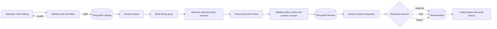
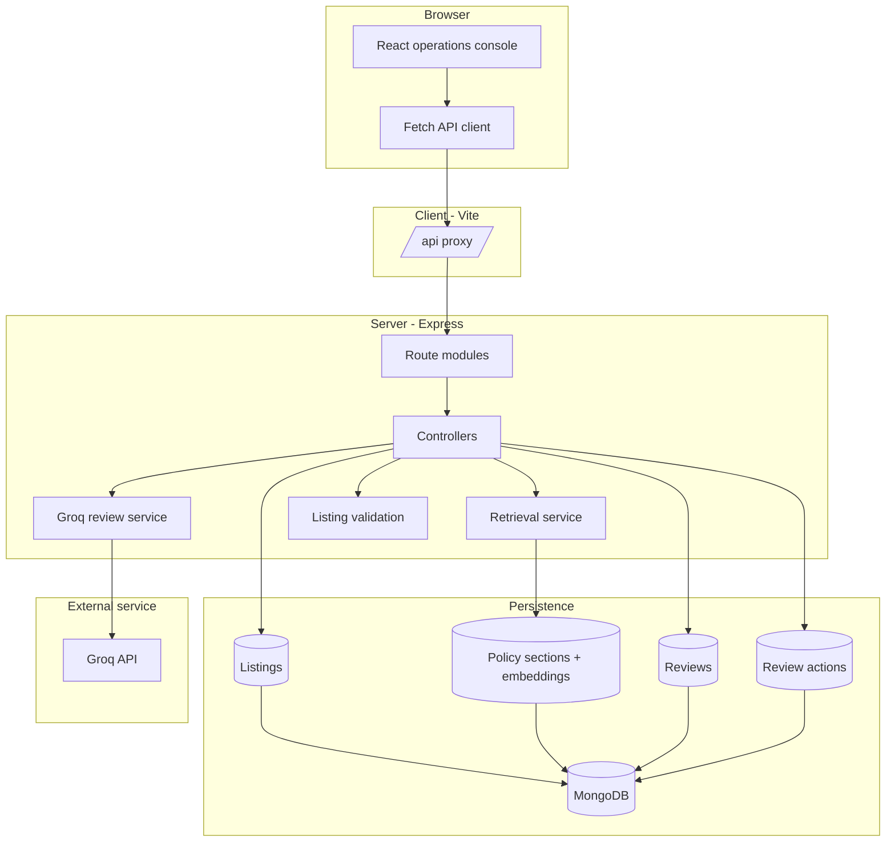
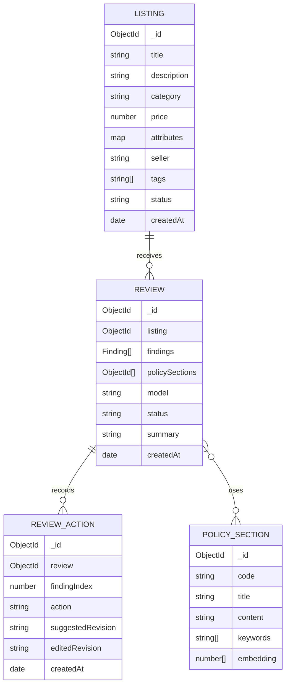

# Marketplace Listing Quality Reviewer

> A policy-grounded operations console for validating, reviewing, and human-approving marketplace listings before publication.

Marketplace Listing Quality Reviewer combines structured listing intake, lightweight local policy retrieval, Groq-powered analysis, and an auditable human decision loop. It is designed for marketplace operations teams that need more than a binary moderation result: every review keeps the relevant policy context, quotes the source text, explains the issue, proposes a conservative revision, and records the reviewer action.

## What It Does

- Creates and validates marketplace listings before review.
- Prevents duplicate listings for the same seller and title.
- Imports up to 20 listings as a JSON batch.
- Retrieves the most relevant policy sections for each listing.
- Sends only the retrieved policy context to the Groq reviewer.
- Produces structured findings with severity, confidence, evidence type, policy code, and suggested revision.
- Lets a human reviewer approve, edit, or reject each finding.
- Records review actions for an audit trail.
- Provides an operations dashboard, review queue, history, and detailed review results.

The application is intentionally human-in-the-loop. AI findings are recommendations; they do not publish, reject, or rewrite marketplace content automatically.

## Product Flow



## Architecture



### Responsibility boundaries

| Layer | Responsibility |
| --- | --- |
| React client | Navigation, forms, loading states, review presentation, and reviewer actions. |
| Vite | Local development server and `/api` proxy to Express. |
| Express routes | Map HTTP methods and paths to controllers. |
| Controllers | Validate request intent, coordinate services, persist results, and shape responses. |
| Validation utility | Enforce listing fields, categories, title/description lengths, and price format. |
| Retrieval service | Build a listing query, create a local embedding, score policy sections, and return the top five. |
| Groq review service | Request strict JSON output, restrict policy citations, and apply a conservative revision backstop. |
| MongoDB | Store listings, policy sections, reviews, and reviewer actions. |

## How a Review Works

1. **Intake**: An operator creates one listing or imports a JSON batch.
2. **Normalization**: Text attributes are converted from `name: value` lines into an object, tags are normalized into an array, and price is converted to a number.
3. **Validation**: Required fields, supported categories, title and description lengths, and non-negative two-decimal prices are checked.
4. **Persistence**: A valid listing is stored with status `ready`. Duplicate title-and-seller combinations are rejected case-insensitively.
5. **Policy retrieval**: The title, description, category, tags, and attribute values are converted into a compact 128-dimension hashed-token embedding. Policy sections are scored with cosine similarity, and the top five are selected.
6. **AI analysis**: The selected policy sections and listing data are sent to Groq with a strict JSON schema. The model must return a summary and zero or more findings.
7. **Safety filtering**: Findings citing unknown policy codes are removed. Suggested revisions containing risky language such as unsupported guarantees, cures, certifications, or superlatives are replaced with neutral guidance.
8. **Review record**: The result stores the listing, findings, model name, summary, and exact policy sections used.
9. **Status update**: A listing becomes `needs_attention` when at least one finding is high severity; otherwise it becomes `reviewed`.
10. **Human decision**: A reviewer approves, edits, or rejects each finding. The action and any edited wording are stored separately in `ReviewAction`.

## Application Areas

### Dashboard

The dashboard presents:

- Total listings.
- Completed reviews.
- Listings needing attention.
- The five most recent reviews.

### New Listing

The intake form captures:

- Title.
- Category.
- Price.
- Seller.
- Description.
- Key-value attributes.
- Comma-separated tags.

### Review Queue

The queue shows validated listings that are ready for review. Starting a review retrieves policy context, calls Groq, stores the result, and opens the review detail screen.

### Review Result

Each finding includes:

- Issue title.
- Severity: `Low`, `Medium`, or `High`.
- Confidence percentage.
- Evidence classification: `confirmed` or `unverifiable`.
- Source quote.
- Explanation.
- Policy code and policy title.
- Suggested revision.

The reviewer can approve, edit, or reject each finding independently.

### Review History

History lists completed reviews and links to their full policy context, findings, and reviewer actions.

### Batch Import

Batch import accepts a JSON array or a `.json` file. The server processes at most 20 listings per request and reports each row independently as `ready`, `invalid`, or `duplicate`. Ready rows can then be reviewed sequentially.

## Repository Structure

```text
.
├── package.json                 # Root scripts for running client and server
├── client/
│   ├── index.html
│   ├── package.json
│   ├── vite.config.js           # Vite server and /api proxy
│   ├── tailwind.config.js
│   ├── postcss.config.js
│   └── src/
│       ├── main.jsx             # React application and UI workflows
│       └── styles.css           # Application styles and design tokens
└── server/
    ├── package.json
    ├── .env.example
    └── src/
        ├── server.js            # Express bootstrap and route mounting
        ├── seed.js              # Policy and sample listing seed data
        ├── config/
        │   └── db.js            # Mongoose connection
        ├── controllers/
        │   ├── dashboardController.js
        │   ├── listingController.js
        │   └── reviewController.js
        ├── middleware/
        │   └── errorHandler.js
        ├── models/
        │   ├── Listing.js
        │   ├── PolicySection.js
        │   ├── Review.js
        │   └── ReviewAction.js
        ├── routes/
        │   ├── dashboardRoutes.js
        │   ├── listingRoutes.js
        │   └── reviewRoutes.js
        ├── services/
        │   ├── groqReviewService.js
        │   └── retrievalService.js
        └── utils/
            ├── embedding.js
            └── validation.js
```

## Data Model



### Listing statuses

| Status | Meaning |
| --- | --- |
| `draft` | Reserved for an unready listing state. |
| `ready` | Validated and waiting for review. |
| `reviewed` | Review completed without a high-severity finding. |
| `needs_attention` | Review completed with at least one high-severity finding. |

### Review finding actions

| Action | Meaning |
| --- | --- |
| `pending` | No human decision has been recorded. |
| `approved` | The reviewer accepts the suggested handling. |
| `edited` | The reviewer supplied revised wording. |
| `rejected` | The reviewer rejects the suggested finding or treatment. |

## API Reference

All API routes are mounted under `/api`.

### Health

| Method | Endpoint | Purpose |
| --- | --- | --- |
| `GET` | `/api/health` | Returns `{ "ok": true }` when the API is running. |

### Listings

| Method | Endpoint | Purpose |
| --- | --- | --- |
| `GET` | `/api/listings` | List listings newest first. |
| `GET` | `/api/listings/:id` | Fetch one listing. |
| `POST` | `/api/listings` | Validate and create one listing. |
| `POST` | `/api/listings/batch` | Validate and create up to 20 listings independently. |

Single-listing creation accepts fields such as:

```json
{
  "title": "Adjustable aluminum laptop stand",
  "description": "Ventilated aluminum stand for laptops from 11 to 16 inches.",
  "category": "Home & Office",
  "price": 34.5,
  "attributes": {
    "material": "Aluminum"
  },
  "seller": "Deskform Supply",
  "tags": ["office", "ergonomic"]
}
```

### Reviews

| Method | Endpoint | Purpose |
| --- | --- | --- |
| `GET` | `/api/reviews` | List reviews with listing and policy references populated. |
| `GET` | `/api/reviews/:id` | Fetch one complete review. |
| `POST` | `/api/reviews` | Run a review for `{ "listingId": "..." }`. |
| `POST` | `/api/reviews/batch` | Review 1–20 listing IDs sequentially. |
| `PATCH` | `/api/reviews/:reviewId/findings/:findingIndex/action` | Record `approved`, `edited`, or `rejected`. |

### Dashboard

| Method | Endpoint | Purpose |
| --- | --- | --- |
| `GET` | `/api/dashboard` | Return dashboard counters and the five latest reviews. |

## Local Development

### Prerequisites

- Node.js 18 or newer.
- npm.
- MongoDB running locally or a reachable MongoDB deployment.
- A Groq API key for AI review requests.

### 1. Install dependencies

From the repository root:

```bash
npm install
npm install --prefix client
npm install --prefix server
```

### 2. Configure the server

Create `server/.env` from the example:

```bash
cp server/.env.example server/.env
```

Set the values for your environment:

```env
MONGODB_URI=mongodb://127.0.0.1:27017/marketplace-reviewer
PORT=5001
CLIENT_URL=http://localhost:5173
GROQ_API_KEY=your_groq_api_key
GROQ_MODEL=openai/gpt-oss-20b
```

`GROQ_API_KEY` is required only when starting an AI review. The API can boot without it, but review requests return a configuration error until it is supplied.

### 3. Align the client proxy

The Vite proxy in `client/vite.config.js` must target the same port as the server `PORT` value:

```js
proxy: { "/api": "http://localhost:5001" }
```

If you use port `5002`, update both `server/.env` and the Vite proxy to `5002`.

### 4. Seed the database

Seeding creates the policy sections and five sample listings used by the application demo:

```bash
npm run seed
```

> The seed script clears the existing `Listing`, `PolicySection`, `Review`, and `ReviewAction` collections before inserting fresh data. Use it only when resetting development data is acceptable.

### 5. Start the application

Run both applications together:

```bash
npm run dev
```

Or run them independently:

```bash
npm run server
npm run client
```

Open the client at [http://localhost:5173](http://localhost:5173). Verify the API with [http://localhost:5001/api/health](http://localhost:5001/api/health).

## Scripts

| Command | Description |
| --- | --- |
| `npm run dev` | Start server and client concurrently. |
| `npm run server` | Start only the server watcher. |
| `npm run client` | Start only the Vite client. |
| `npm run seed` | Reset and seed development data. |
| `npm run build` | Build the client for production. |
| `npm run dev --prefix server` | Start the server directly from the server package. |
| `npm run dev --prefix client` | Start Vite directly from the client package. |

## Policy Retrieval and AI Guardrails

The reviewer is grounded in retrieved policy context rather than receiving an unrestricted policy prompt.

- Policy sections are seeded with a compact local embedding.
- Listing text and policy text use the same deterministic hashed-token embedding function.
- Cosine similarity ranks policy sections without requiring a vector database.
- The top five sections are passed to Groq.
- The response must conform to a strict JSON schema.
- Policy codes are checked against the retrieved set.
- Suggested revisions are scanned for common risky claims and replaced with neutral guidance when necessary.
- The reviewer is instructed not to treat an unsupported claim as proven false; it may classify it as `unverifiable`.
- A human remains responsible for the final action.

This approach keeps the project lightweight and explainable for a prototype or internal tool. It is not a replacement for a production policy platform with versioned policy governance, access control, model evaluation, or a dedicated vector index.

## Operational Notes

- There is currently no authentication or role-based authorization layer.
- CORS is limited to `CLIENT_URL`.
- The API waits for MongoDB before it begins listening.
- Batch review calls are sequential by design to preserve per-listing outcomes and keep Groq traffic predictable.
- Review history stores the policy sections used for each review, supporting later inspection of the model context.
- The duplicate constraint is based on title and seller with case-insensitive collation.
- API errors are returned as JSON and surfaced in the client UI.
- The current local embedding is lexical and intentionally small; semantic similarity quality will be limited compared with a production embedding model.

## Production Hardening Checklist

Before exposing the application to real marketplace traffic, consider:

- Add authentication, authorization, and reviewer identity to actions.
- Move secrets to a managed secret store and rotate any exposed development credentials.
- Add rate limits, request IDs, structured logs, and monitoring.
- Add automated tests for validation, retrieval, review parsing, action recording, and batch behavior.
- Version policy sections and retain the policy version used by every review.
- Add model timeout, retry, and provider-failure handling with durable failed-review records.
- Replace the local hashed-token retrieval layer with a managed embedding and vector-search strategy when policy volume grows.
- Add content redaction and data-retention controls for seller and listing data.
- Add a publish gate so reviewed content cannot bypass the human decision workflow.

## License

No license has been specified for this repository yet.
